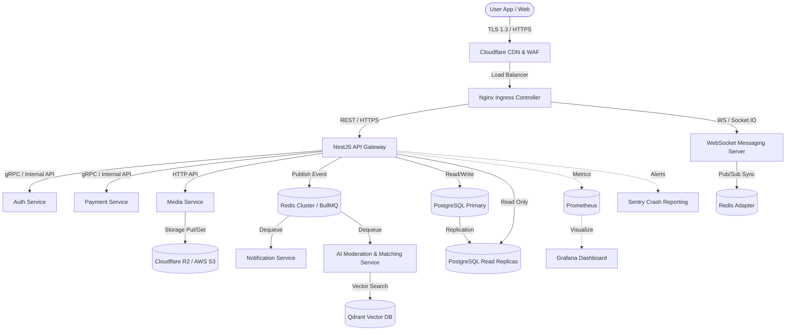

# System Architecture & Infrastructure Topology - MatchNova

MatchNova uses a modular, microservice-based architecture to guarantee scale, fault tolerance, and security.

---

## 1. Architectural Overview

The system is decomposed into specialized, decoupled service layers orchestrated by Kubernetes (EKS/GKE).

---

## 2. Service Definitions

### 2.1 NestJS API Gateway
* **Responsibilities**: Entry point for REST APIs, request validation, authentication checks, profile CRUD, swipe processing, and query coordination.
* **Communication**: Communicates via gRPC to internal microservices (Auth, Payment) and posts asynchronous jobs to BullMQ queues.

### 2.2 WebSocket Messaging Server (Socket.IO)
* **Responsibilities**: Manages persistent TCP connections for real-time text delivery, presence status, typing indicators, and signaling for peer-to-peer WebRTC video calls.
* **Clustering**: Scaled horizontally. Node synchronization is handled via a **Redis Pub/Sub adapter** to route messages when matches are connected to different socket replicas.

### 2.3 Auth Service
* **Responsibilities**: Manages user registration, JWT lifecycle (refresh token rotation), OAuth exchanges (Google, Apple, Facebook), and SMS OTP validations.
* **Storage**: Redis stores active OTP codes (3-minute TTL) and blacklisted JWT tokens.

### 2.4 AI Moderation & Matching Service (Python / Qdrant)
* **Responsibilities**: 
  1. Computes profile vector embeddings (1536-dim) on update and indexes them in Qdrant.
  2. Executes vector search query pipelines.
  3. Screens uploaded media for NSFW content using PyTorch classifiers.
  4. Generates dynamic icebreaker prompts using OpenAI APIs.

### 2.5 Media Optimization Service
* **Responsibilities**: Manages uploads via signed URLs to Cloudflare R2/AWS S3. Processes, resizes, and converts images into compressed `.webp` formats asynchronously.

### 2.6 Payment Service
* **Responsibilities**: Manages subscription configurations, checkout pipelines, stripe customer mappings, and consumes Stripe/Paystack/Flutterwave webhook notifications.

### 2.7 Notification Service (BullMQ Worker)
* **Responsibilities**: Consumes push notifications from Redis queues and formats payloads for Apple Push Notification Service (APNs) and Firebase Cloud Messaging (FCM).

---

## 3. Infrastructure & Scaling Strategy

* **Kubernetes Orchestration**: Services run in separate node pools. The WebSocket servers scale based on active TCP connections, while the API gateway scales on CPU utilization.
* **Database Resiliency**: PostgreSQL uses a Primary-Replica setup. Swiping operations query read-replicas, while swipe writes are queued and written asynchronously in batches to protect the primary database transaction logs.
* **Caching Layer**: Redis Cluster caches user sessions, active match matrices, and rate-limiting counters.
